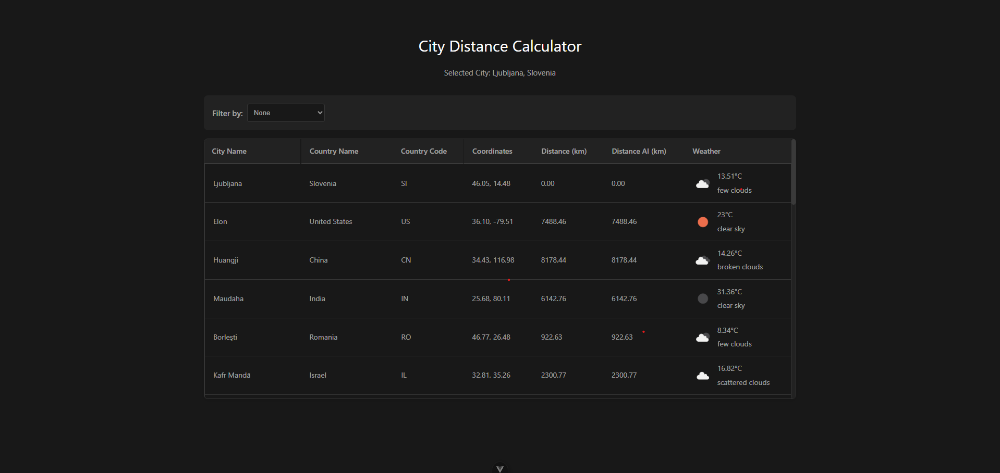

# 🌍 City Distance

A web application that displays the distance from the user's location (or a selected city) to 25 randomly selected cities across the globe. Built with Vue 3, TypeScript, and Pinia, featuring real-time weather data and responsive design.

## 🌐 Try It Live!

A working implementation is available at: https://city-distance-2ggsn.ondigitalocean.app/



## ✨ Features

- ✅ **Automatic Location Detection** - Uses browser geolocation to set the initial reference point
- ✅ **Interactive City Selection** - Click any city to set it as the new reference point
- ✅ **Dual Distance Calculation** - Shows distances using both custom and AI-generated Haversine formulas
- ✅ **Real-Time Weather Data** - Displays current weather conditions for each city
- ✅ **Responsive Table** - Adapts to different screen sizes with smart column hiding
- ✅ **Weather Filtering** - Filter cities by temperature and weather conditions

## 🛠 Tech Stack

- **Frontend**: Vue 3 (Composition API) + TypeScript
- **Backend**: Express.js + TypeScript
- **State Management**: Pinia
- **Styling**: CSS
- **API Integration**: OpenWeather API for weather data

## 📐 Distance Calculation

The app implements two versions of the Haversine formula to calculate distances between cities:

1. **Custom Implementation**:
```typescript
export const calculateDistance = (
  lat1: number,
  lon1: number,
  lat2: number,
  lon2: number
): number => {
  const toRad = (degrees: number): number => degrees * (Math.PI / 180);
  const R: number = 6371;

  const dLat: number = toRad(lat2 - lat1);
  const dLon: number = toRad(lon2 - lon1);
  const radLat1: number = toRad(lat1);
  const radLat2: number = toRad(lat2);

  const hav: number = Math.pow(Math.sin(dLat / 2), 2) +
            Math.cos(radLat1) * Math.cos(radLat2) *
            Math.pow(Math.sin(dLon / 2), 2);
  
  const distance: number = 2 * R * Math.asin(Math.sqrt(hav));

  return distance;
};
```

2. **AI-Generated Implementation**:
```typescript
export const calculateDistanceAI = (
  lat1: number,
  lon1: number,
  lat2: number,
  lon2: number
): number => {
  const R: number = 6371;
  const toRadians = (degrees: number): number => degrees * (Math.PI / 180);

  const dLat: number = toRadians(lat2 - lat1);
  const dLon: number = toRadians(lon2 - lon1);

  const radLat1: number = toRadians(lat1);
  const radLat2: number = toRadians(lat2);

  const a: number =
    Math.sin(dLat / 2) * Math.sin(dLat / 2) +
    Math.sin(dLon / 2) * Math.sin(dLon / 2) * Math.cos(radLat1) * Math.cos(radLat2);
  
  const c: number = 2 * Math.atan2(Math.sqrt(a), Math.sqrt(1 - a));
  
  return R * c;
};
```

Both implementations use the Haversine formula to calculate the great-circle distance between two points on a sphere using their latitudes and longitudes. The Earth's radius (6371 km) is used as the sphere's radius.

## 🚀 Getting Started

### Option 1: Using Docker Compose (Recommended)

1. Clone the repository

2. Move to frontend and create a `.env` file with your OpenWeather API key:
```bash
cd city-distance
```
```env
VITE_OPENWEATHER_API_KEY=your_api_key_here
VITE_API_BASE_URL=http://localhost:3000
```

3. Start the services in the root:
```bash
docker-compose up
```

The application will be available at:
- Frontend: http://localhost:80
- Backend: http://localhost:3000

### Option 2: Manual way

1. Clone the repository
2. Start the backend server:
```bash
cd server
npm install
npm start
```

3. In a separate terminal move to frontend and create a `.env` file with your OpenWeather API key:
```bash
cd city-distance
```
```env
VITE_OPENWEATHER_API_KEY=your_api_key_here
VITE_API_BASE_URL=http://localhost:3000
```

4. Start the development server:
```bash
npm install
npm run dev
```

The application will be available at:
- Frontend: http://localhost:5173
- Backend: http://localhost:3000

## 🤖 Use of AI

AI tools were used in the following ways:
- Generated an alternative implementation of the Haversine formula
- Assisted in code organization and TypeScript type definitions
- Helped with responsive design implementation
- Provided suggestions for state management structure

## 📱 Responsive Design

The table adapts to different screen sizes:
- **Desktop**: Shows all columns
- **Medium screens**: Hides country name, country code, and coordinates
- **Mobile**: Shows only city name, distance, and weather
